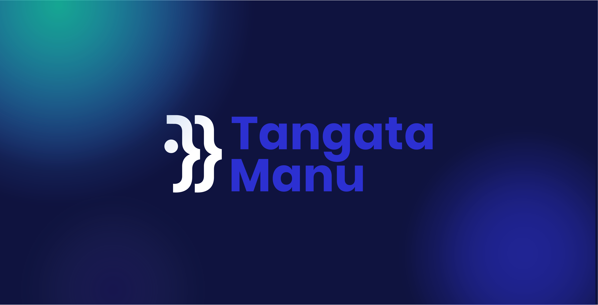

# Tangata Manu


Cardano chain data-importer (replacement for the `project-icarus-importer`)

# Abstract

Tangata Manu is a tool to import Cardano blockchain data into an easily usable database storage (e.g. Postgres database). The main goal of the project is to provide the main middle-layer functionality and to allow easy connection for new custom data-storage connectors or data-provider connectors, basically allowing to read blockchain data from any source with an API (for example, different full-node implementations), and export it into any custom storage or database that you can connect.

## Pre-requisites

* NodeJS v12.9.1. We recommend [nvm](https://github.com/creationix/nvm) to install it
* [Postgres 11.2] (https://www.postgresql.org/) as DB engine. For development purposes we
  suggest using Docker but local installation could be used as well (not both,
  obviously). For Mac, we recommend https://postgresapp.com.

## Configuration

All the environment specific configurations can be found in `$PROJ_ROOT/config` folder.
They are loaded using [config](https://www.npmjs.com/package/config) package.

## Development environment

We recommend using [Docker](https://hub.docker.com/_/postgres/) to quickly setup the DB in dev environment:

```
docker pull postgres:11.2;
docker run --name postgres -p 5432:5432 -e POSTGRES_PASSWORD=mysecretpassword -d postgres;
```

And then, to create the db, you need to do:

```
docker exec -it postgres psql -U postgres;
create database yoroi_blockchain_importer;
```

1.  Clone this repo, `git clone --recursive git@github.com:Emurgo/tangata-manu.git`
1.  Select correct NodeJs version, `nvm use`
1.  Install dependencies, `yarn install`
1.  Init database schema, `yarn run migrate up`
1.  Start the app, `yarn run dev`.


## Create database schema migration
We use [node-pg-migrate](https://github.com/salsita/node-pg-migrate) for migrations. Migrations are located in `migrations/` folder. To create e new one, execute:
1.  `yarn run migrate create <short> <description>`

# Run development environment

1. Start postgres, `docker run --name postgres -p 5432:5432 -e POSTGRES_PASSWORD=mysecretpassword -d postgres`
1. Go to `cardano-http-bridge` directory, `cd cardano-http-bridge`
1. Run `cardano-http-bridge`, `cargo run --package cardano-http-bridge --bin cardano-http-bridge start --port 8082 --template=testnet2`
1. Go to `yoroi-importer` directory, `cd yoroi-importer`
1. Start the app, `yarn run dev`.

# Documentation

```
        +----------------------+
        |                      |
        | Tangata Manu Starts  |
        |                      |
        +-----------+----------+
                    |
                    v
```

1. Architecture explained: [docs/architecture.md](docs/architecture.md)
2. Flow chart visualisation: [docs/flow.md](docs/flow.md)

# Tangata Manu meaning

The Tangata manu ("bird-man," from tangata "human beings" + manu "bird") was the winner of a traditional competition on Rapa Nui (Easter Island). The ritual was an annual competition to collect the first sooty tern (manu tara) egg of the season from the islet of Motu Nui, swim back to Rapa Nui and climb the sea cliff of Rano Kau to the clifftop village of Orongo.

From: Wikipedia contributors, "Tangata manu," Wikipedia, The Free Encyclopedia, https://en.wikipedia.org/w/index.php?title=Tangata_manu&oldid=907590181 (accessed September 3, 2019).

# Special Thanks

To the [Cardano Foundation](https://cardanofoundation.org/en/) for their support so this project could be open-sourced to the community.
